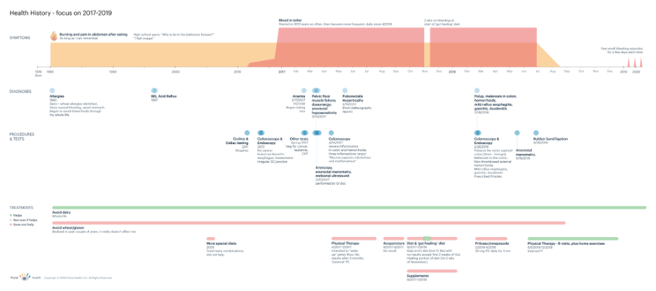
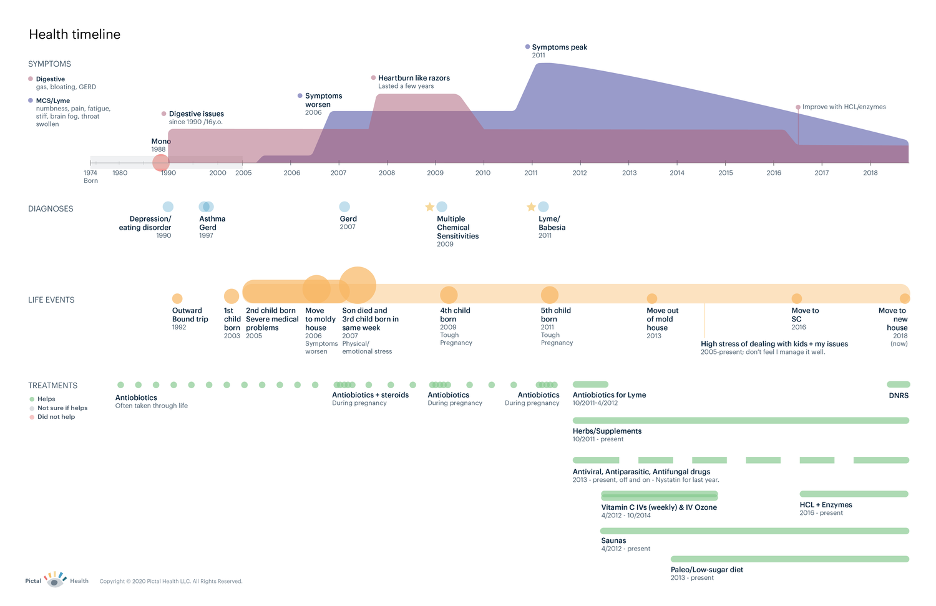
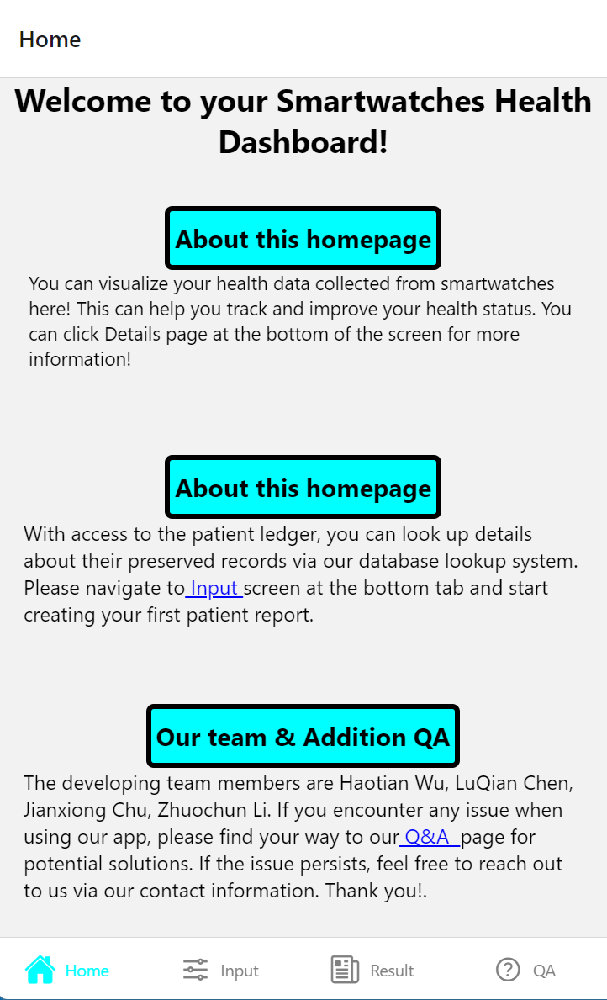
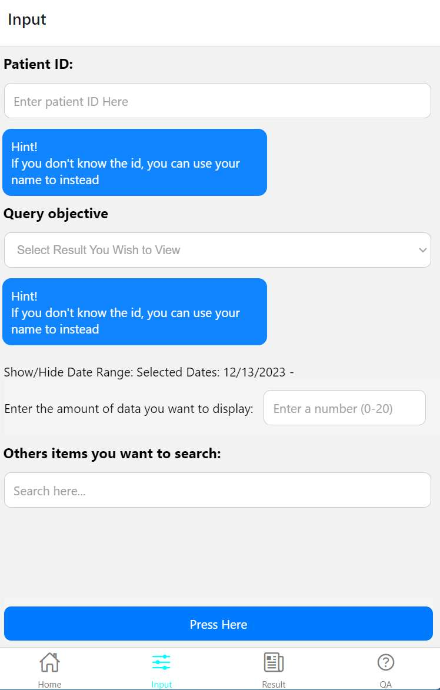
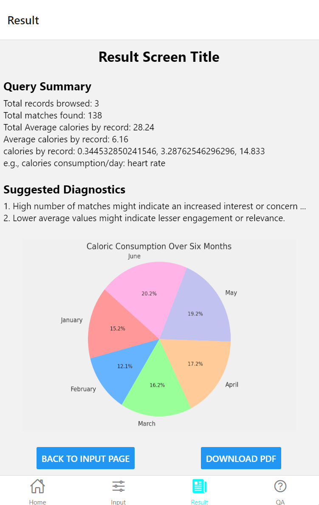
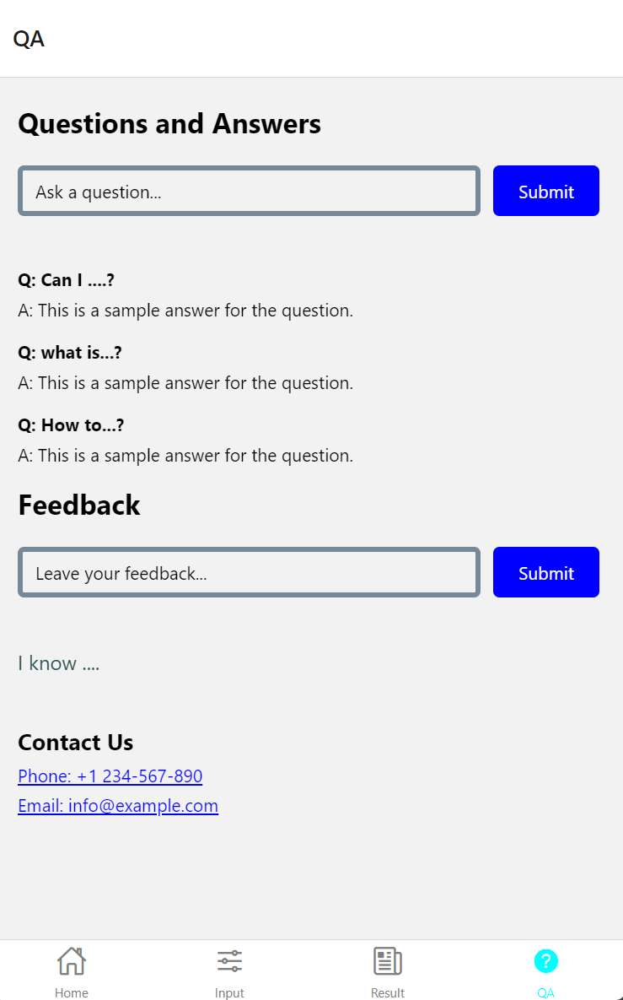

# INFSCI 2470 Final Project Report
#### Smartwatch Dashboard System

Group 1

**Members**: Haotian Wu, LuQian Chen, Jianxiong Chu, Zhuochun Li

**Advisors**: Yalini Senathirajah, Peter Brusilovsky

## Introduction
Throughout this project, our team collaborated under the guidance of Dr. Yalini Senathirajah, our client. The project's focus centered on creating a web-based application tailored to visualize data derived from smartwatches. The primary goal was to aid medical professionals, specifically personal doctors, in diagnosing respiratory disorders by utilizing real-time data obtained from smartwatches. 

The application's key technical features encompass the seamless integration of real-time smartwatch data, an intuitive graphical timeline visualization, and the provision of user annotations to provide contextual insights. The project's overarching objective involves subjecting the application to testing via patient trials, ensuring its practical implementation and effectiveness within a real-world medical environment.

In summary, the project is progressing with a strong emphasis on developing a practical, user-friendly, and adaptable application for medical professionals. This application aims to facilitate the analysis and diagnosis of respiratory disorders through the visualization of data obtained from smartwatches. Continuous collaboration and attentive consideration of user preferences remain pivotal for ensuring the project's success and efficacy within the medical community.

## Design & Functions Analysis
User Study
Considering the user context, the application caters primarily to medical personnel who possess access to Apple Watch data belonging to their respective patients. Users prioritize confidentiality and adhere to ethical standards while accessing patient data. They rely on customized tools to derive diagnostic insights from the accumulated smartwatch data. The user behavior underscores a propensity for frequently referencing the presented data during the diagnostic process and clinical trials. Additionally, users favor viewing distinct diagrams on separate screens and consistently engage in data sanitization practices to eliminate irrelevant information from their analysis.

## Task Analysis
As outlined by project descriptions, the system is designed to facilitate several essential tasks:
- Retrieve prepared datasets from the database upon user request and generate corresponding diagrams.
- Display the generated diagrams in tabular or graphical formats, employing customized styling tailored for various screen sizes and device variations.
- Allow users to define parameters, offering flexibility for tuning and adjusting the displayed results according to their preferences.
There are lots of graphing libraries (like plotly.com or highcharts.com) that we can use with no need to do all the graphical plotting from scratch. Some examples of the kind of plots that can be visualized are below.

 
Thus, ease of use and insight-promoting visualizations are important needs for the HCI.

## Design Patterns 
Based on the possible project descriptions provided by Dr. Yalini Senathirajah and subsequent direct discussions with her, our group conducted in-group brainstorming to design three distinct patterns for the application to achieve the desired goal:
1. Full Web-based Application
   - Technology: HTML/CSS/JavaScript
   - Access: Device browser
   - Pros: Ease of implementation
   - Cons: Limitations imposed by the browser environment

2. Separated Application
   - Technology: HTML/CSS/JavaScript (web), Xcode/Android Studio (mobile)
   - Access: Separate apps for web and mobile
   - Pros: Offers an authentic user experience
   - Cons: Tedious implementation process, challenges in ensuring consistency across platforms

3. Hybrid Application
   - Technology: React Native
   - Access: Single application usable across different operating systems
   - Pros: Provides an authentic experience, potentially lower cost
   - Cons: Requires filling knowledge gaps and conducting further research to ensure successful implementation and compatibility.

Sample dataset: After we discussed with Dr. Yalini Senathirajah the data we will get processed, she gave us a public dataset about Apple Watch and Fitbit data. l. The objective of this dataset was to examine whether commercial wearable devices could accurately predict lying, sitting, and different physical activity intensities in a lab-based protocol. 46 participants were asked to wear smart wearable devices and various data was recorded during the process. Minute-by-minute heart rate, steps, distance, and calories from Apple Watch and Fitbit were included in the whole dataset. Therefore, this sample dataset could provide us with the typical format of health data collected from smart devices. In this way, we can study a better way to display them for users, which should meet the design request and handle the concept of interactive systems. The dataset is available via this resource: https://www.kaggle.com/datasets/aleespinosa/apple-watch-and-fitbit-data/data

## Implementation Framework
Application Navigations
With debates from analysis and design presentation, we refined our designs and redrafted conceptual graphs for the entire app. There are four main screens and users can navigate to their desired page via the bottom tab menu or interactive button in screens.
 

## Page Concept Graph
Even though our client did not explicitly request a concept graph for all pages, we strongly believe it's crucial to outline drafts for each page. This approach allows us to develop our application with a clear goal in mind. As a result, we have plotted a page concept graph specifically focusing on the input and result screens—considered the most crucial pages within our application. This concept graph enables us to monitor our development process, ensuring alignment with our goals and enabling timely corrections of any encountered issues.
 

## Development
Framework: React Native
Our group ultimately opted for React Native as the development framework due to its seamless integration with the original purpose of implementing a 2-pane display. While it aligns well with our intended design, it's worth noting that this framework is unfamiliar to most team members. To bridge this gap, additional preliminary studies and preparatory work were undertaken to facilitate the team members' adaptation to this framework before commencing development.

## Page: Home Screen
Responsibility:
- Serves as the welcoming page for users upon booting up the app.
- Offers introductory information about key functionalities and navigation guidance.

#### Feature:
- Offers convenient navigation options accompanied by descriptions of various functionalities available within the app.
 

## Page: Input Screen
Responsibility:
- Presents options enabling users to customize search queries and define query objectives.

#### Feature:
- Incorporates helpful bubbles that assist users in generating input.
- Includes dropdown menus and input sanitization for enhanced usability and data accuracy.

## Page: Result Screen
Responsibility:
- Displays the results of the customized query generated by the user.

#### Feature:
- Offers the option to redesign the query based on the displayed results.
- Provides users with the capability to save the report as a PDF file for preservation purposes.
 

## Page: Q&A Screen
Responsibility:
- Provides answers to frequently asked questions submitted by other app users, which are published by the admin.
- Allows users to submit any questions, which can be reviewed and processed by the admin.

#### Feature:
- Offers contact information for additional requests or inquiries from app users.
- Provides a platform for users to offer feedback regarding their experience with the app.
 

